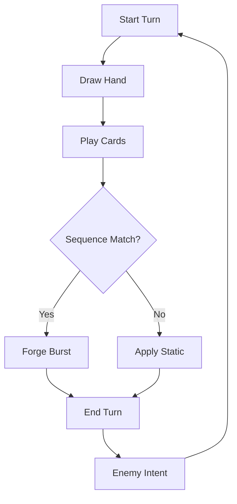
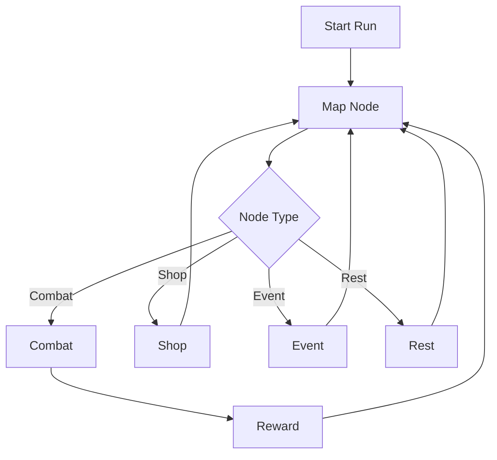

# Signal Forge - Production Spec

## 0. Change Log
- v1.0 initial production spec

## 1. Vision
Signal Forge is a fast, skill-based roguelike deckbuilder where the core mastery is building waveform sequences to trigger powerful forge effects. Runs are short, readable, and highly replayable.

## 2. Target Platform
- Web (desktop + mobile)
- Input: mouse, keyboard, touch
- Performance target: 60 FPS on mid-range laptops and modern phones

## 3. Game Pillars
- Sequence mastery: order matters; perfect chains are the best power source.
- Deck tension: repetition creates static and Glitch risks.
- Short, punchy runs: 10 to 15 minutes end-to-end.

## 4. Player Experience Goals
- Quick onboarding in under 2 minutes.
- First win in 3 to 5 runs for average players.
- Continuous sense of momentum through tempo meter.

## 5. Systems Overview
- Combat system: turn-based deckbuilder with sequence targets.
- Map system: branching node map with encounter types.
- Progression: in-run rewards + meta unlocks.
- Economy: run currency, shop prices, and unlock currency.

## 6. Core Data Model
### 6.1 Entities
- Card: id, name, cost, type, rarity, tags, effect, sequenceValue
- Relic: id, name, rarity, effect, trigger
- Enemy: id, archetype, intent patterns, hp, damage scaling
- Encounter: id, enemy set, sequence pattern, reward table
- Run: seed, floor, node index, deck, relics, currency, stats

### 6.2 Determinism
- Seeded RNG for map, rewards, and enemy intents
- Combat outcomes are deterministic with identical inputs

## 7. Combat System
### 7.1 Turn Flow
1. Start turn: draw up to hand size, apply start-of-turn effects.
2. Player plays cards until energy or actions end.
3. End turn: apply end-of-turn effects.
4. Enemies execute intents.

### 7.2 Hand and Draw
- Base hand size: 5
- Base draw per turn: 5
- Max hand size: 10 (discard excess)

### 7.3 Energy
- Base energy: 3
- Energy can be increased by relics or cards

### 7.4 Sequence System
- Each encounter has a visible target sequence, length 2 to 5.
- Sequence types: Pulse, Sine, Saw, Noise.
- Each card contributes one waveform to the sequence chain.
- Completing a sequence triggers Forge Burst.
- Partial chain gives minor bonus (configurable).

### 7.5 Forge Burst
- Triggered on full sequence match within a single turn.
- Default Burst: deal 8 damage to all enemies.
- Variants from relics and upgrades.

### 7.6 Tempo Meter
- Gain 1 tempo per correct sequence step.
- Lose 1 tempo on mismatch or end turn.
- At 6 tempo, unlock Finisher card for one turn.

### 7.7 Static and Glitch
- Each repeated waveform in a turn increases Static by 1.
- Static threshold at 4 inserts 1 Glitch card into discard.
- Glitch cards are dead draws unless converted by Stabilize.

### 7.8 Shield
- Shield absorbs damage before HP.
- Shield decays by 1 at end of turn.

## 8. Economy
### 8.1 Run Currency
- Earned from combat and elites.
- Used in shops for cards, relics, and removal.

### 8.2 Shop Prices (Base)
- Common card: 40
- Uncommon card: 70
- Rare card: 110
- Relic: 120
- Card removal: 60

### 8.3 Meta Currency
- Earned per run based on floor and boss clear.
- Unlocks new starter decks, card families, cosmetics.

## 9. Map and Encounters
### 9.1 Map Structure
- 3 floors
- Each floor: 6 to 8 nodes
- At least 2 branches per floor

### 9.2 Node Types
- Combat: standard enemies
- Elite: higher reward, higher risk
- Shop: spend currency
- Mod Station: apply card mods
- Rest: heal or remove card
- Event: random choice outcomes
- Boss: end of floor

### 9.3 Encounter Tables
- Floor 1: 70% basic, 20% mixed, 10% elite
- Floor 2: 50% mixed, 30% advanced, 20% elite
- Floor 3: 40% advanced, 40% elite, 20% boss

## 10. Card List (MVP)
### 10.1 Common Cards
- Pulse Strike: cost 1, Pulse, deal 6
- Pulse Tap: cost 0, Pulse, deal 3
- Sine Guard: cost 1, Sine, gain 7 shield
- Sine Bridge: cost 1, Sine, gain 4 shield, draw 1
- Saw Rush: cost 1, Saw, deal 5, draw 1
- Saw Latch: cost 1, Saw, deal 4, gain 2 tempo
- Noise Spike: cost 2, Noise, deal 9, gain 1 Static
- Noise Shard: cost 1, Noise, deal 5, add 1 Glitch to discard

### 10.2 Uncommon Cards
- Overdrive Coil: cost 0, Pulse, next card triggers twice
- Pulse Repeater: cost 1, Pulse, add Pulse to sequence chain twice
- Sine Barrier: cost 2, Sine, gain 14 shield
- Sine Reset: cost 1, Sine, remove 1 Glitch, draw 1
- Saw Flurry: cost 2, Saw, deal 5 to all enemies
- Saw Anchor: cost 2, Saw, deal 8, gain 4 shield
- Noise Bloom: cost 2, Noise, deal 7, add 1 Glitch to hand, gain 2 tempo
- Noise Cancel: cost 1, Noise, remove 2 Static

### 10.3 Rare Cards
- Forge Nova: cost 3, Pulse, deal 18 to all enemies
- Phase Cascade: cost 2, Sine, gain 10 shield, draw 2
- Razor Choir: cost 2, Saw, deal 14, gain 3 tempo
- Blackout: cost 1, Noise, purge all Glitch in discard, draw 2
- Wildcard: cost 1, Any, counts as any waveform

### 10.4 Glitch Cards
- Static: unplayable, exhaust on draw
- Feedback: cost 1, deal 2 to self, draw 1

## 11. Card Mods
- Echo: repeat effect at 50% strength
- Sustain: keep card in hand next turn
- Overdrive: reduce cost by 1, add 1 Static
- Clean: remove Static gain from a card

## 12. Relic List (MVP)
- Oscillator Core: first Pulse each turn is free
- Phase Shifter: one sequence step can be any waveform
- Static Sink: remove 1 Static at end of turn
- Tempo Gear: gain +1 tempo on first match each turn
- Coil Capacitor: start combat with +1 energy on floor 2+
- Glass Dial: sequences are 1 shorter on floor 1 only
- Signal Mirror: first Saw each turn gains +3 damage
- Echo Node: after Forge Burst, draw 1
- Clean Room: Glitch cards exhaust on draw
- Fault Lens: gain +10 currency when taking a Glitch
- Pulse Compass: see next node reward type
- Sine Loom: shield decay reduced to 0 on your first turn

## 13. Enemies
### 13.1 Archetypes
- Disruptors: add Glitch cards
- Brutes: big hits, low defense
- Swarmers: multiple small hits
- Shielders: gain shield and punish long turns

### 13.2 Enemy List
- Disruptor Drone: adds 1 Glitch every 2 turns
- Iron Brute: heavy single hit every 2 turns
- Swarm Node: 3 small units, weak to AOE
- Shield Relay: shields allies each turn

### 13.3 Bosses
- The Modulator: changes sequence every 2 turns
- The Fault: applies Static each turn unless sequence is perfect

## 14. Events (Examples)
- Lost Oscillator: remove a card or gain a relic with 1 Glitch
- Static Shrine: purge all Glitch, lose 10 HP
- Broken Studio: duplicate a card, add Feedback

## 15. Difficulty Curve
- Floor 1 sequences length 2 to 3
- Floor 2 sequences length 3 to 4
- Floor 3 sequences length 4 to 5

## 16. UI/UX
### 16.1 Layout
- Enemy top center
- Player HUD bottom center
- Hand at bottom
- Draw pile left, discard right
- Sequence tracker above hand

### 16.2 Readability
- Large waveform icons, color-coded
- Clear intent icons for enemies
- Sequence glow when matched

## 17. Art Direction
- Industrial synth, oscilloscope motifs
- High-contrast card frames
- Dark grid backgrounds with scanlines
- Glow effects for sequences and bursts

## 18. Audio Direction
- Adaptive synth score per floor
- Card play waveform clicks
- Burst adds harmonic swell
- Glitch adds static hiss

## 19. Controls
- Desktop: click/drag cards, hotkeys 1-5
- Mobile: tap to select, tap to play

## 20. Telemetry
- Run start/finish
- Floor reached
- Sequence accuracy rate
- Glitch insertion count
- Average run time

## 21. Accessibility
- Color-blind safe waveform icons
- Large tap targets on mobile
- Optional reduced motion

## 22. Production Plan
### 22.1 MVP Milestones
- Week 1: core combat, deck, and sequence system
- Week 2: map, nodes, enemy intents
- Week 3: cards, relics, balance pass
- Week 4: UI polish, audio, leaderboard

### 22.2 Risk List
- Sequence system complexity
- Mobile input friction
- Balance of Static vs power

## 23. Systems Diagrams
### 23.1 Combat Loop

### 23.2 Run Flow

## 24. Balance Math
### 24.1 Damage Scaling
- Base enemy HP: 25 + (5 * floor)
- Base player damage per card: 5 to 9
- Sequence bonus per match: 8 damage to all enemies
- Scaling factor: 1.1x per floor for enemy health

### 24.2 Shield Math
- Base shield per card: 4 to 7
- Shield decay per turn: 1 (unless relic modifies)
- Player base HP: 50 + (10 * floor)

### 24.3 Tempo Economy
- Tempo gain per sequence step: 1
- Finisher cost: 6 tempo
- Finisher effect: next card costs 0 and triggers twice
- Finisher value: approximately 15 to 20 extra damage

### 24.4 Cost Calculations
- Free cards (cost 0): limit 1 per turn
- Cost 1 cards: 3 to 5 energy value
- Cost 2 cards: 6 to 8 energy value
- Premium rarity scaling: +20% effect for same cost

### 24.5 Static Pressure
- Threshold for Glitch: 4 Static
- Glitch card penalty: dead draw or -2 damage on play
- Stabilize value: 2 Static removal per card

## 25. Card Synergy Archetypes
### 25.1 Pulse Burn (Tempo Focus)
- Core cards: Pulse Strike, Overdrive Coil, Pulse Repeater
- Synergy: spam Pulse to build tempo rapidly
- Relic pairs: Oscillator Core, Tempo Gear

### 25.2 Sine Shield (Durability Focus)
- Core cards: Sine Guard, Sine Barrier, Sine Reset
- Synergy: consistent shield generation with utility
- Relic pairs: Static Sink, Clean Room

### 25.3 Saw All-In (Burst Focus)
- Core cards: Saw Flurry, Saw Rush, Razor Choir
- Synergy: high upfront damage with card draw
- Relic pairs: Echo Node, Pulse Compass

### 25.4 Noise Chaos (Glitch Conversion)
- Core cards: Noise Spike, Blackout, Noise Cancel
- Synergy: generate Glitch then convert to advantage
- Relic pairs: Fault Lens, Signal Mirror

## 26. Win Condition Design
### 26.1 Win Paths
- Path A: Tempo spam (build Finisher repeatedly)
- Path B: Shield wall (block damage, outlast)
- Path C: Burst chain (match sequences every turn)
- Path D: Glitch abuse (convert Static to currency/draw)

### 26.2 Rough Viability
- All 4 paths should be viable to floor 3 boss
- No single dominant strategy in ideal balance
- Deck dilution is penalty at random card picks

## 27. Difficulty Tuning Parameters
- Sequence length by floor
- Enemy damage scaling
- Static pressure per encounter
- Shop pricing

### 27.1 Difficulty Targets
- Floor 1: 60% win rate for average player
- Floor 2: 35% win rate for average player
- Floor 3: 15% win rate for average player

## 28. Metrics and Tuning
### 28.1 Combat Metrics
- Average combat duration: 4 to 7 turns
- Average damage dealt per turn: 12 to 18
- Average shield absorbed: 20 to 40 per run

### 28.2 Deck Metrics
- Average cards added per run: 8 to 12
- Average cards removed per run: 2 to 4
- Average Glitch cards per run: 3 to 6

### 28.3 Economy Metrics
- Average currency earned per run: 200 to 400
- Shop visits per run: 2 to 4
- Average cards purchased per shop: 1 to 2

## 29. Leaderboard Metrics
- Primary: fastest boss clear time
- Secondary: highest tempo chain
- Tertiary: most currency earned in single run
- Seasonal resets: monthly

## 30. Mobile-Specific Tuning
- Enlarged card hitboxes: 64x96px minimum
- Drag threshold: 20px before committing to play
- Tap hold for card preview: 500ms
- Auto-sort hand: by waveform type

## 31. Summary of Card Pools by Rarity
- Common (40% pick weight): efficient basic cards
- Uncommon (40% pick weight): synergy enablers
- Rare (20% pick weight): game-changing effects
- Avg picks per run: 10 cards

## 32. Notable Card Interactions
- Overdrive + Forge Nova: 36 damage for 3 energy
- Sine Barrier + Shield Relay: scales shield generation
- Noise Bloom + Fault Lens: Glitch becomes income
- Wildcard + Pulse Repeater: guaranteed sequence match

## 33. Future Expansion Ideas
- Additional waveform types (Harmonic, Sub)
- Ancient relics with downside effects
- Boss tokens that modify dungeon
- Daily challenge runs with fixed seed
